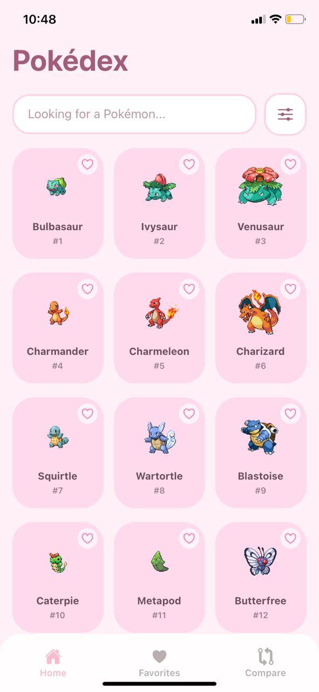
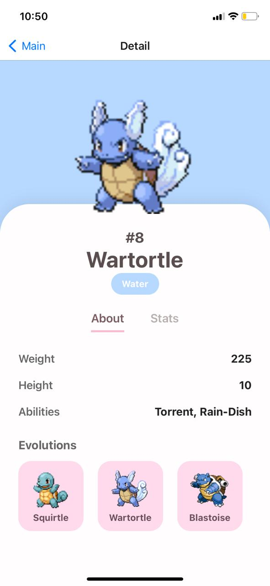
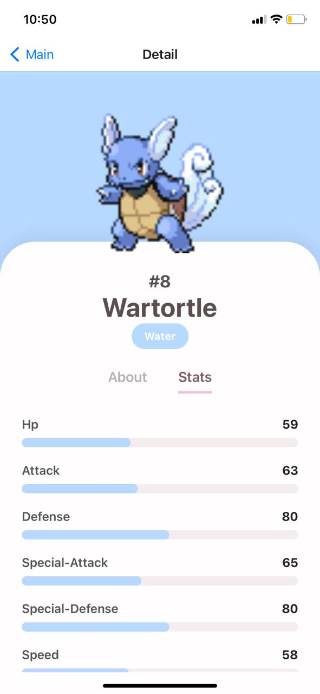
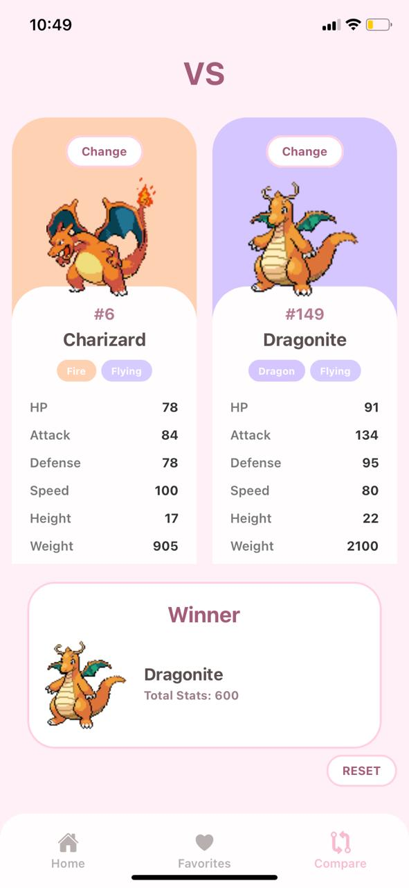
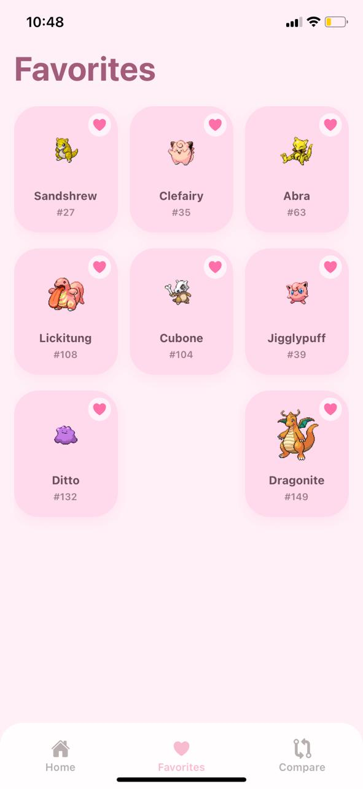

# Pokémon App

Aplicación móvil simple construida con Expo y React Native para explorar, comparar y guardar tus Pokémon favoritos.

## Requisitos
- Node.js
- Expo CLI (se recomienda usar `npx expo`)

## Instalación
1. Instala dependencias:

```bash
npm install
```

2. Inicia la app con Expo:

```bash
npx expo start
```

## Estructura del proyecto
- `App.js` / `index.js`: Entrada de la aplicación
- `src/screens/`: Pantallas (`HomeScreen`, `DetailScreen`, `CompareScreen`, `FavoritesScreen`)
- `src/services/pokemonService.ts`: Lógica para obtener datos de Pokémon
- `src/storage/favoritesStorage.ts`: Almacenamiento de favoritos
- `src/utils/pokemonColors.ts`: Colores por tipo de Pokémon

## Capturas de pantalla

### HomeScreen

Pantalla principal que muestra la lista de Pokémon.



### DetailScreen

Pantalla de detalle con la información de un Pokémon.




### CompareScreen

Pantalla para comparar dos Pokémon.



### FavoritesScreen

Pantalla con tus Pokémon favoritos guardados.


